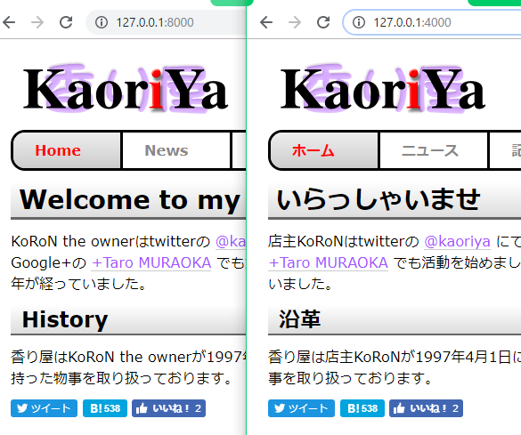

# koron/sedproxy

[](https://godoc.org/github.com/koron/sedproxy)
[](https://circleci.com/gh/koron/sedproxy/tree/master)
[](https://goreportcard.com/report/github.com/koron/sedproxy)

sedproxy is a HTTP reverse proxy, which rewrite HTML with regular expressions.



## Getting started

Go 1.13.3 or above is recommended.

To install or update sedproxy:

```console
$ go get -u -i github.com/koron/sedproxy
```

Start reverse proxy.

```console
$ sedproxy -target http://127.0.0.1:4000/ -messages messages.json
```

Let's access http://127.0.0.1:8000/


## Usage

```
sedproxy [OPTIONS]
```

### Options

* `-accesslog` - Output access log to STDERR (default disabled)
* `-addr` - Address and port which reverse proxy to listen.
* `-messages` - JSON file for substitutions.
* `-target` - Target HTTP server to rewriting.

    `SEDPROXY_TARGET` environment variable can be used, instead of this.

### Message JSON format

The schema of message file is (in [JSON schema][jsonschema] in YAML format):

```yaml
type: array
items:

  title: Substitution Group
  description: |
    A substitution group is a pair of `mediaTypes`, `path` and `items`.

    A substitution group will be evaluated when both `mediaTypes` and `path`
    conditions are passed.

    Actual substitutions are in `items`.
  type: object
  properties:
    mediaTypes:
      type: array
      items:
        type: string
      description: |
        Array of media types which this substitution group is applied to.
        Media type is core part of `Content-Type`.
        For example, the media type of `text/html; charset=utf8` is `text/html`.
        When one of the media types was matched with `Content-Type`,
        this substitution group will be evaluated.
        When this is omited, only `text/html` will be used as default.
        So you should put `text/javascript`, if you want to apply a
        substitution group to JavaScript.
    path:
      type: string
      description: |
        A regexp pattern to match with "path" of HTTP request.

        See <https://golang.org/pkg/regexp/syntax/> for the syntax.
    items:
      type: array
      items:

        title: A substitution pair.
        description: |
          A pair of regexp pattern and replacement text.
        type: object
        properties:
          src:
            type: string
            description: |
              A regexp pattern to match with "body" of HTTP response.
              See <https://golang.org/pkg/regexp/syntax/> for the syntax.
          repl:
            type: string
            description: |
              Replacement text.  Captured texts can be refered by `$1` or so.
              See <https://golang.org/pkg/regexp/#Regexp.Expand> for the
              expansion.
```

See <./messages.json> for example.
